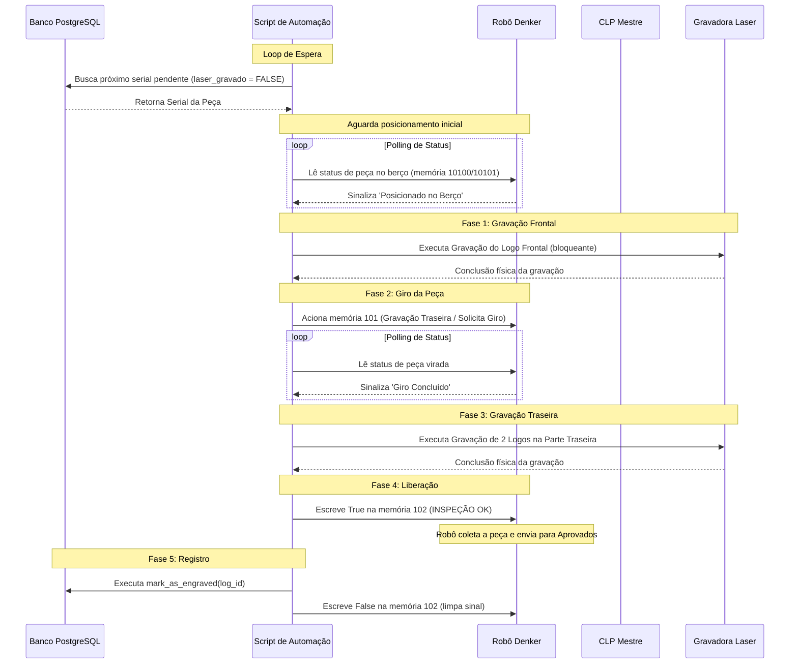

# Analista de Automação

Esta habilidade orienta o agente na criação, modificação e depuração de fluxos de automação no projeto de controle de marcação a laser. Ela consolida as regras de negócio e de comunicação entre a gravadora laser, o CLP (Controlador Lógico Programável), o Robô Denker e o banco de dados PostgreSQL.

## When to use this skill

- Ao implementar novos scripts de automação de fluxo (ex: `fluxo_automatico.py`).
- Ao depurar a ordem de acionamentos ou leituras de registradores Modbus do CLP e do Robô.
- Ao configurar a geração de códigos de barra dinâmicos com gravação subsequente na laser.
- Ao mapear novos status ou ações físicas de controle na máquina.

## How to use it

### 1. Diretrizes de Comunicação com Dispositivos

#### A. Gravadora Laser (BJJCZ LMCV4)
- **Conectividade**: Comunicação via USB encapsulada em [balor/sender.py](file:///C:/Users/paulo/Desktop/balor/balor/sender.py).
- **Controle Físico**: A chamada `laser.execute(command_list)` é **síncrona (bloqueante)**. Ela pausa a execução do script Python até que os motores dos espelhos galvo terminem de desenhar fisicamente toda a arte.
- **Checagem Não-Bloqueante**: Pode ser feito polling chamando `laser.is_busy()` (que lê a resposta USB e verifica o bit `0x04`).

#### B. CLP e Robô Denker (Modbus TCP)
- **CLP**: IP `192.168.1.5`, Porta `502`.
- **Robô (Denker)**: IP `192.168.1.8`, Porta `502`.
- **Lógica de Endereçamento**:
  - `addr < 10000`: Coils (Binário R/W)
  - `10000 <= addr < 30000`: Discrete Inputs (Binário R-Only, mapeado subtraindo 10000)
  - `30000 <= addr < 40000`: Input Registers (16-bit R-Only, mapeado subtraindo 30000)
  - `addr >= 40000`: Holding Registers (16-bit R/W, mapeado subtraindo 40000)
- **Fallback do Robô**: Se ler ou escrever em um Coil no Robô falhar, utilize Holding Registers ou Input Registers no mesmo endereço como fallback.

---

### 2. O Ciclo do Fluxo Automático

O fluxo automático opera como uma máquina de estados contínua. Ele deve seguir rigorosamente a sequência descrita abaixo:



---

### 3. Convenções de Código para Implementações

1. **Imports sugeridos**:
   ```python
   from pyModbusTCP.client import ModbusClient
   from db_module import DBManager
   from plc_panel import ModbusDevice
   from balor.sender import Sender
   from balor.command_list import CommandBinary
   ```
2. **Tratamento de Exceções**: A perda de conexão com o banco ou com a laser não deve parar o loop. O sistema deve registrar o log do erro e tentar se reconectar indefinidamente a cada 2 ou 5 segundos.
3. **Logs**: Cada mudança de estado da automação deve ser impressa no terminal com um prefixo identificável (ex: `[AUTO-ESTADO]`).
